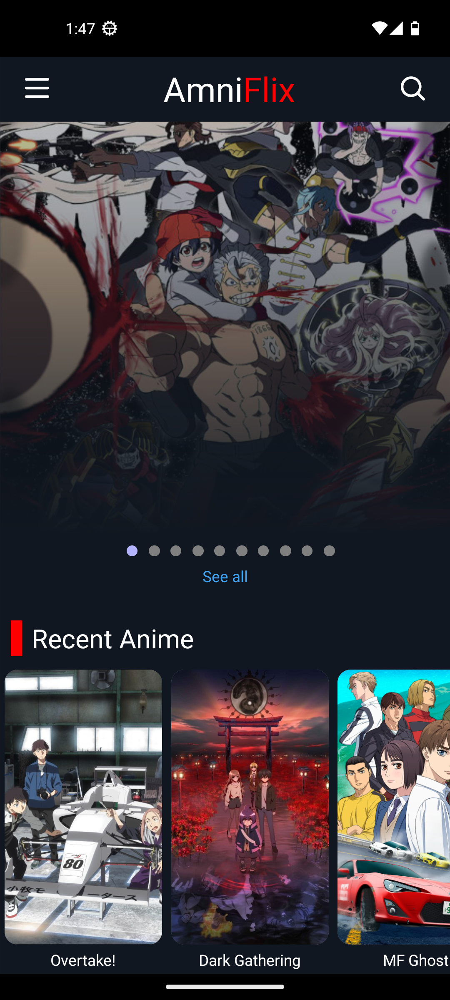
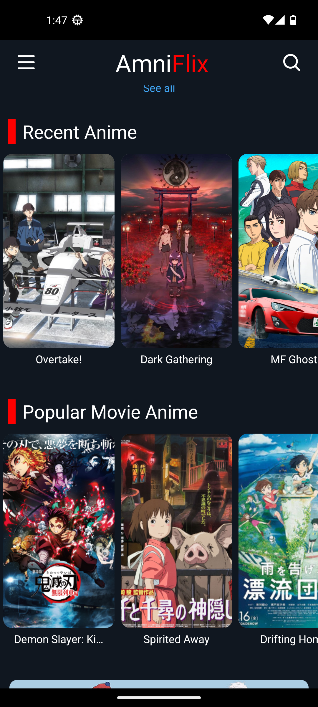
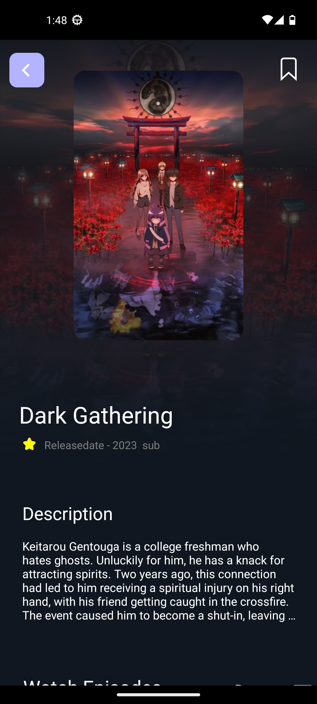
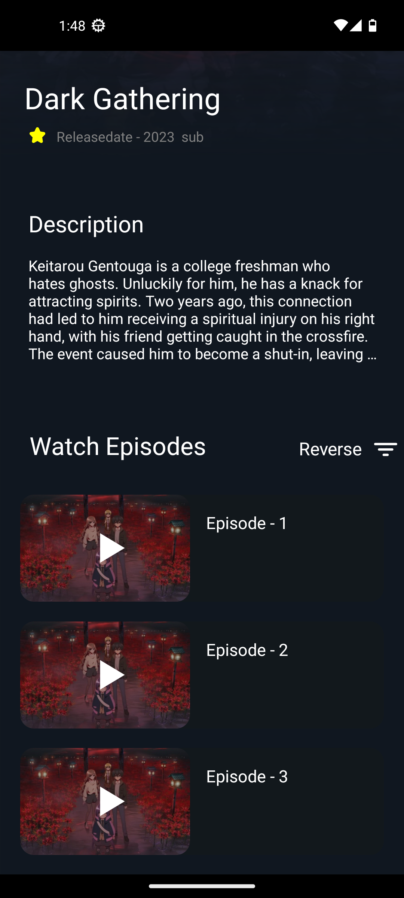
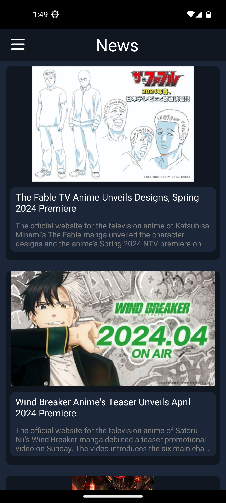

 

---

 

    

    
    
  

 

## DISCLAIMER

The app is still in alpha, so it may not work as expected. If you find any bugs, please report them in the [issues](https://github.com/solo243/NewAmniFlix/issues) section.

## Features/Planned Features

- [x] Ad Free
- [x] Fast
- [x] Responsive
- [x] Dub support
- [x] News support

      

Further down the line features
- [ ] Movies
- [ ] Tv shows 
- [ ] more trackers (trakt, mal etc etc)
      

 

## SCREENSHOTS

<table>
  <thead>
    <tr>
      <th colspan="5">ANDROID</th>
    </tr>
  </thead>
  <tbody>
    <tr>
        <td>
            
        </td>
        <td>
            
        </td>
        <td>
            
        </td><td>
            
        </td><td>
            
        </td>
    </tr>
    <tr>
        <td colspan="3">
            
        </td>
    </tr>
  
  </tbody>
</table>

 

## INSTALLATION INSTRUCTIONS

ANDROID

Make sure you have install from unknown sources enabled

it will most likely ask you to enable this anyway

1. [Download the apk.](https://houseofhopes.itch.io/amniflix)
2. Install the apk.
3. Open the app.

 

## Contributing
Contributions to the AmniFlix are welcome! If you find a bug, have a feature suggestion, or want to contribute improvements, Please make a pull request and i shall take a look at it

 

## INSTALLATION AND SETUP

Prerequisites

Before you begin, ensure you have met the following requirements:

- [Node.js](https://nodejs.org/) installed (LTS version recommended)
- [Expo CLI](https://docs.expo.dev/get-started/installation/) installed globally
- A package manager such as [npm](https://www.npmjs.com/get-npm) or [Yarn](https://classic.yarnpkg.com/en/docs/install/) installed
- [Git](https://git-scm.com/) for version control

Getting Started

1. Clone repo  
 `git clone https://github.com/solo243/NewAmniFlix`

2. Install node packages  
 `npm install` or `yarn install`

3. Start expo  
 `expo start`

4. Open android  
  `a`

